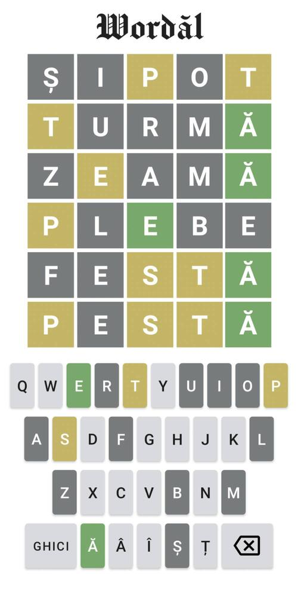

# Wordăl
My (very) basic adaptation of Wordle, a word-guessing game.

An Android copycat in Romanian of the original web-based game Wordle, by Josh Wardle:
https://www.nytimes.com/games/wordle/index.html

This is how the game looks like when you open it:

Now, you have to start guessing a word (a noun, more precisely) chosen randomly by the app.

You begin by typing some 5-letter words from the Romanian lexis (including those containing ă, â, î, ș, ț).

The game will show you which letters of the chosen word you have correctly guessed and whether or not they are in the right place.

Green means the letter is in the right place, yellow means the letter is somewhere else in the chosen word.

You have a maximum of 6 guesses. 

If by the end of them you will have guessed the right word, the game will end.

You win!

However, if you don't find the right word, the game will tell you which one it was.

Better luck next time!

Example of a won game:

Example of a lost game:

