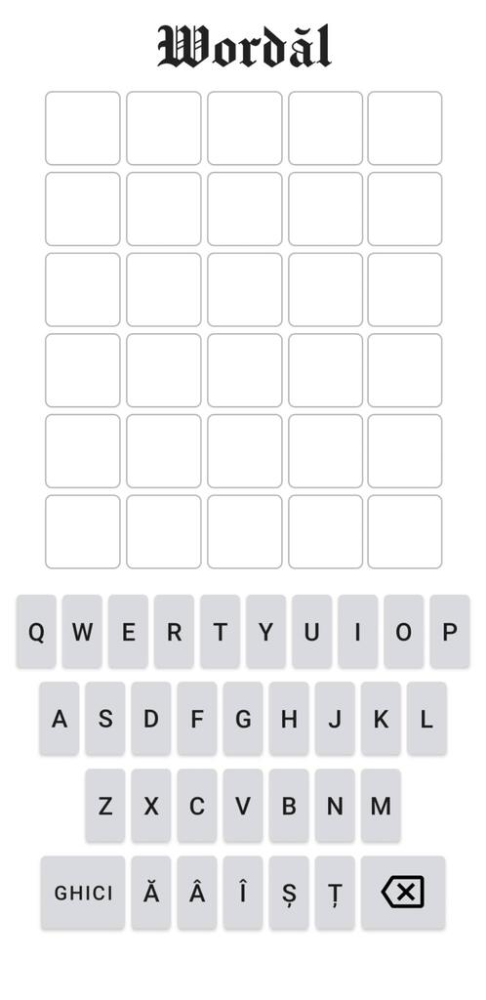

# Wordăl
My (very) basic adaptation of Wordle, a word-guessing game.

An Android copycat in Romanian of the original web-based game Wordle, by Josh Wardle:
https://www.nytimes.com/games/wordle/index.html

This is how the game looks like when you open it:

Now, you have to start guessing a word (a noun, more precisely) chosen randomly by the app.

You begin by typing some 5-letter words from the Romanian lexis (including those containing ă, â, î, ș, ț).

The game will show you which letters of the chosen word you have guessed and whether or not they are in the right order.

